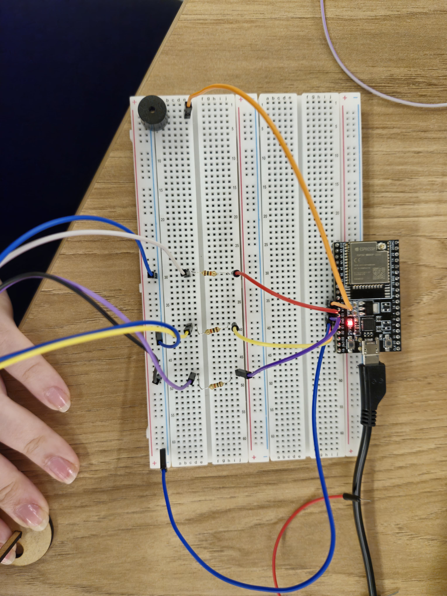

# Semáforo - Semana 3 Módulo 4

## Fotos e Vídeos 

### Fotos de cima 

<div align="center">
<sub>Montagem de Cima <a href="#c6"></a></sub> </br>
<br>
</div><br>

### Vídeo do funcionamento

https://github.com/user-attachments/assets/8d6886e5-eb67-471d-9619-e9f66c5f0695

**Ir além:** foi adicionado um buzzer que emite um som durante 500 milissegundos entre a luz verde e a amarela. 

## Código

```c
// Definindo os pinos dos LEDs
const int ledVermelho = 14;
const int ledAmarelo = 13;
const int ledVerde = 12;
// Definindo o pino do buzzer
const int buzzer = 27;

void setup() {
  // Inicializando os pinos como saídas
  pinMode(ledVermelho, OUTPUT);
  pinMode(ledAmarelo, OUTPUT);
  pinMode(ledVerde, OUTPUT);
  pinMode(buzzer, OUTPUT); 
}

void loop() {
  // Fase vermelha - Ligando o LED vermelho por 6 segundos
  digitalWrite(ledVermelho, HIGH);
  delay(6000);
  digitalWrite(ledVermelho, LOW);
  
  // Fase amarela - Ligando o LED amarelo por 2 segundos
  digitalWrite(ledAmarelo, HIGH);
  delay(2000);
  digitalWrite(ledAmarelo, LOW);

  // Fase verde - Ligando o LED verde por 4 (2+2) segundos
  digitalWrite(ledVerde, HIGH);
  delay(2000);
  // simulando um tempo adicional para pedestres terminarem a travessia
  delay(2000);
  digitalWrite(ledVerde, LOW);
    
  // Fase amarela - Ligando o LED amarelo por 2 segundos
  digitalWrite(ledAmarelo, HIGH);
  digitalWrite(buzzer, HIGH); // Ativa o buzzer junto com o LED amarelo
  delay(500);
  digitalWrite(buzzer, LOW); // Desativa o buzzer
  delay(1500);
  digitalWrite(ledAmarelo, LOW);
}
```

## Componentes utilizados 

| cComponente  | Quantidade |
| ------------ | ---------- |
| LED Vermelho  | 1 |
| LED Verde  | 1 |
| LED Amarelo  | 1 |
| Buzzer  | 1 |
| Resistor  | 3 |
| ESP32  | 1 |
| Cabo  Micro USB 2.0  | 1 |
| Jumper Macho-Macho  | 5 |
| Jumper Macho-Fêmea  | 6 |
| Protoboard  | 1 |

## Avaliação em Pares

**Avaliador**: Gabriel Henrique Martins Alves

| Critério                                                                                                 | Contempla (Pontos) | Contempla Parcialmente (Pontos) | Não Contempla (Pontos) | Observações do Avaliador |
|---------------------------------------------------------------------------------------------------------|--------------------|----------------------------------|--------------------------|---------------------------|
| Montagem física com cores corretas, boa disposição dos fios e uso adequado de resistores                | Até 3              | Até 1,5                            | 0                        | (3) Contempla  |
| Temporização adequada conforme tempos medidos com auxílio de algum instrumento externo                  | Até 3              | Até 1,5                          | 0                        | (3) Contempla |
| Código implementa corretamente as fases do semáforo e estrutura do código (variáveis representativas e comentários) | Até 3              | Até 1,5                          | 0                        | (3) Contempla |
| Extra: Implmeentou um componente de liga/desliga no semáforo e/ou usou ponteiros no código | Até 1              |  Até 0,5                         | 0                        | (1) Contempla |
|  |                                                             |  | **Pontuação Total** | 10 |

